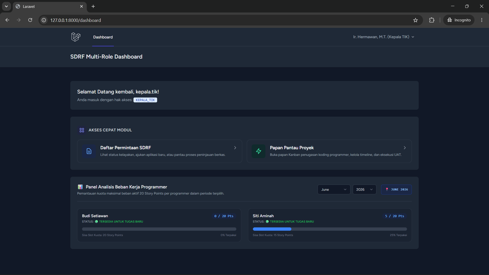

# 🚀 SDRF (Software Development Form Request) & Dynamic Workload Management System

SDRF adalah aplikasi berbasis web (Laravel) yang dirancang untuk mengelola siklus hidup permintaan pengembangan aplikasi (Software Request) sekaligus memantau kapasitas beban kerja tim programmer secara dinamis dan transparan.

Sistem ini dilengkapi dengan **Protokol Manajemen Konflik Otomatis** untuk menangani permintaan darurat (_Urgent Request_) tanpa merusak kalender kapasitas kerja tim.

---

## ✨ Fitur Utama

- **📊 Dynamic Dashboard Analytics:** Visualisasi metrik utilitas dan beban kerja riil programmer secara _real-time_ berdasarkan distribusi hari kerja bulanan (_overlap calculation_).
- **⚔️ Automated Conflict Management Protocol:** Jika Kepala TIK memasukkan proyek darurat pada programmer yang sudah penuh kapasitasnya ($\ge$ 20 Story Points), sistem menyediakan jalur intervensi darurat (Urgent Checkbox).
- **⏳ Advanced Case Suspension (Project Splitting):** Saat proyek darurat disahkan, proyek aktif yang berjalan otomatis dipotong masa tenggatnya menjadi `CLOSE_SUSPENDED`. Sisa bobot pekerjaan yang belum selesai otomatis dilahirkan kembali sebagai proyek pecahan (`[SISA SUSPEND: X Pts]`) di dalam antrean `WAITING` tanpa tanggal kerja.
- **⚙️ Custom Rule Engine Validation:** Membedakan validasi durasi pengerjaan. Proyek baru wajib tunduk ketat pada rentang _T-Shirt Size_ (S/M/L/XL), sedangkan proyek pecahan sisa suspend mengaktifkan _Bypass Validation_ agar rentang waktunya dapat diatur fleksibel sesuai diskresi Kepala TIK.
- **🧪 Integrated User Acceptance Testing (UAT):** Alur validasi dua arah di mana user pengaju wajib melakukan uji coba di server staging dan memberikan keputusan _Approve_ atau _Reject_ beserta umpan balik teks.
- **🔒 Secure Audit Trail & Logging:** Setiap mutasi status, alokasi jadwal, dan eksekusi intervensi darurat dicatat permanen di dalam tabel `project_history_logs` demi transparansi audit institusi.

---

## 🛠️ Arsitektur & Teknologi Utama

- **Backend Framework:** Laravel 10 / 11
- **Frontend Styling:** Tailwind CSS & Blade Components
- **Database:** MySQL / PostgreSQL
- **State Management:** PHP Enums Model Casting (Mengunci keamanan mutasi status `RequestStatus` dan `ProjectStatus`).
- **Data Integrity:** `DB::transaction` untuk mengamankan proses _split_ proyek saat manajemen konflik terjadi (atomisitas database).

---

## 📐 Aturan Estimasi & Kuota Kapasitas

### 1. Pemetaan T-Shirt Size ke Story Points

- **S (Small):** Estimasi 1–3 hari kerja | **2 Poin**
- **M (Medium):** Estimasi 1–2 minggu kerja (7–14 hari) | **5 Poin**
- **L (Large):** Estimasi 3–4 minggu kerja (21–28 hari) | **10 Poin**
- **XL (Extra Large):** Estimasi > 1 bulan kerja | **20 Poin**

### 2. Status Kapasitas Programmer (Batas Maksimal 20 Poin/Bulan)

- `< 15 Poin :` **Available Capacity** 🟢
- `15 - 19 Poin :` **Near Full Capacity** 🟡
- `≥ 20 Poin :` **Full Capacity / Overloaded** 🔴

---

## 🚀 Cara Instalasi

1. Clone repositori ini:

    ```bash
    git clone [https://github.com/username](https://github.com/username) Anda/sdrf-management-system.git
    cd sdrf-management-system
    ```

2. Install dependensi composer:

```Bash
composer install
```

3. Install dependensi npm & compile aset:

```Bash
npm install && npm run build
```

4. Salin file lingkungan .env dan sesuaikan konfigurasi database Anda:

```Bash
cp .env.example .env
php artisan key:generate
```

5. Jalankan migrasi database beserta seeder (jika ada):

```Bash
php artisan migrate --seed
```

6. Jalankan server lokal:

```Bash
php artisan serve
```

7. 📄 Lisensi
   Proyek ini dilisensikan di bawah MIT License.

### Screen Demo


